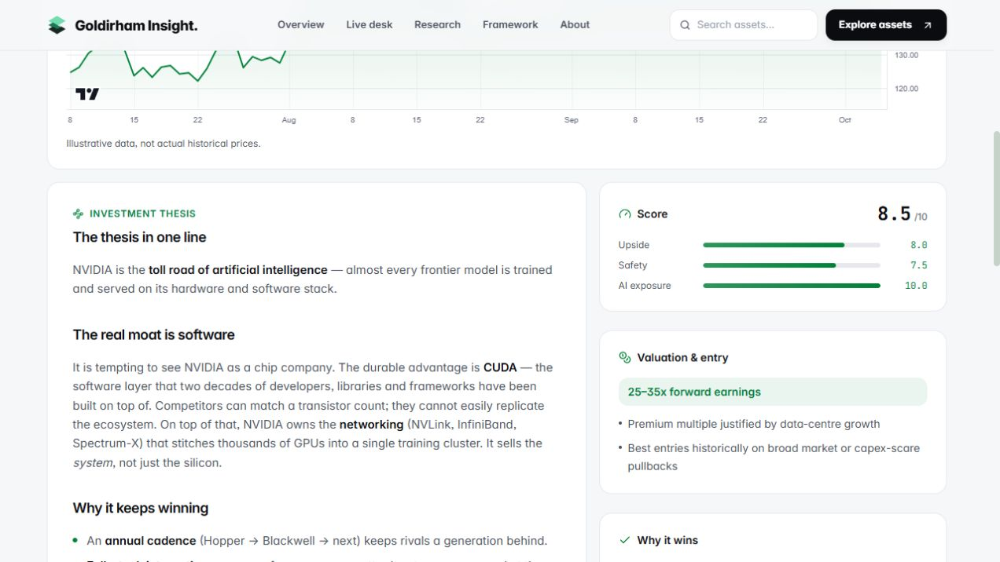

# Goldirham engineering review and roadmap

Reviewed 5 October 2026 in `E:\workspace\Projects\Goldirham`.

The README and AGENTS.md identify this as an educational investment research demo,
covering the AI economy for readers comparing researched assets. They identify
Vercel as its host. Deployment configuration and production logs were not supplied
or verified. No incident logs were supplied. This review covers the current local
source, not a branch diff or a comprehensive audit of investment claims.

Existing `.gitignore` edits and the untracked brand kit were preserved. No files
were deleted, no dependencies upgraded, and nothing was committed, pushed, or deployed.

## 1. Architecture summary

1. Next.js 16.3.6 App Router, React 19.2.8, strict TypeScript and Tailwind CSS 3.
2. `app/layout.tsx` supplies local fonts, navigation, footer and a shared client market provider.
3. Home, 26 asset pages and five category pages render from the local research catalog.
4. `lib/assets.ts`, `lib/categories.ts` and `lib/card.ts` separate research content from lightweight card props.
5. `/api/quotes` combines CoinGecko crypto quotes, optional Finnhub stock quotes and simulated fallbacks.
6. `/api/chart` uses CoinGecko crypto history or deterministic simulated history; Lightweight Charts renders it.
7. `LiveMarketProvider` polls quotes six seconds after completion; API adapters use per-process TTL caches.
8. No database, authentication, payment flow, background worker or automated CI configuration is present in the inspected source.

### Baseline and final checks

All commands used Node v22.23.3, enabled by `& 'E:\workspace\Projects\Use-Node22.ps1'`.

| Check | Before changes | Final result |
|---|---|---|
| `npm.cmd run lint` | Passed | Passed after correcting test-file lint configuration |
| `tsc.cmd --noEmit --incremental false` / `npm.cmd run typecheck` | Passed | Passed |
| `npm.cmd run build` | Passed; 35 generated pages | Passed; 35 generated pages |
| Automated tests | No test script or test suite existed | Added 12 network-isolated regression tests; 12 passed |
| New regression suite against original implementation | 2 passed, 10 failed | 12 passed, 0 failed |
| `npm.cmd audit --json` | Exit 1: seven high development dependency entries | Same unresolved advisory chain |
| `npm.cmd audit --omit=dev` | `found 0 vulnerabilities` | Production dependencies unchanged |
| HTTP smoke checks against local production server | Not run before fixes | Homepage + 26 assets + five categories returned 200; five chart ranges passed; unknown chart symbol returned 404; repeated NVDA returned one quote |
| Browser checks | Original raw italic markers reproduced | Search, empty state/reset, category cross-listing, safety sorting, previews, ticker pause, keyboard navigation, chart range switching and mobile menu passed |

The tests use real adapter/route code, a small TypeScript transpilation loader and
mocked fetch responses. They verify behavior without live keys or provider calls;
they do not replace framework compilation or a full browser regression suite.
The production server used for browsing had both optional API keys explicitly
disabled. Public CoinGecko quotes were observed; authenticated Finnhub integration
was verified through fixtures and documented header semantics, not a real account.

Browser details: the Utilities filter showed six assets including cross-listed
ICLN; Safest ranked NEE (10.0) ahead of 9.5-rated assets; header search + Enter
opened NVDA; 1D and 1Y charts became visible with the correct selected controls;
mobile Escape closed the menu and returned focus to its toggle. At a 390px
viewport there was no page-width overflow. No warning/error console messages were
captured in the checked flows. Viewport overrides were reset afterward.

## 2. Error and fix table

Line references identify the current files. Each fixed item has a corresponding
small hunk in [fixes.patch](fixes.patch); the complete pre-fix regression output
is preserved in [baseline-tests.txt](baseline-tests.txt).

| Severity | File | Problem / root cause | Fix | Status |
|---|---|---|---|---|
| High, development tooling | `package-lock.json:2541` | `braces` 3.0.3 is affected by a stack-exhaustion advisory; seven audit entries represent its dependent package chain, not seven independent vulnerabilities. | No safe patched release identified. Evaluate tooling migration separately. | Open |
| High, feed integrity | `lib/sources.ts:73`, `components/LiveMarketProvider.tsx:57` | Crypto JSON was trusted; null/zero prices could be published as live, making the client reject the whole quote batch. Null change was invented as 0%; -100% divided by zero when deriving previous close. | Validate each record, omit invalid records so only affected assets fall back, retain genuine change values. | Fixed; tests 1–2 |
| Medium, credentials | `lib/sources.ts:151` | Finnhub token was embedded in a URL, which can be captured by request tracing/logs. No evidence of an actual leak was found. | Send `X-Finnhub-Token` in a header and encode the symbol. | Fixed; test 10 |
| Medium, feed integrity | `lib/sources.ts:158` | Stock validation only checked truthiness of price; missing/null change fields could be coerced into false zero changes or invalid values. | Require finite price/change fields and a valid provider timestamp. | Fixed; test 3 |
| Medium, chart availability | `lib/sources.ts:111` | Chart data was checked for length only; invalid values reached the client as CoinGecko history and bypassed simulation fallback. | Validate timestamps and positive finite prices before returning history. | Fixed; tests 4 and 11 |
| Medium, provider load | `app/api/quotes/route.ts:15` | Repeated symbols each created a quote and potentially a provider call. | Deduplicate normalized symbols before looking up assets. | Fixed; test 5 and HTTP check |
| Medium, provider load | `lib/sources.ts:22` | Cache stored only completed successes. Concurrent misses fanned out, and failures retried on every request. | Share pending promises and retain failed results for the existing TTL before retrying. | Fixed; tests 6–7 |
| Medium, data provenance | `app/api/quotes/route.ts:39`, `:53`; `lib/sources.ts:83`, `:164` | API reads replaced actual observation time with `Date.now()`, including reads of cached data. | Carry CoinGecko `last_updated_at` and Finnhub `t` through as milliseconds. Keep response `ts` as response time. | Fixed; test 9 |
| Low, cache consistency | `lib/sources.ts:54` | In-place `ids.sort()` mutated the caller; duplicate IDs created distinct cache entries for equivalent requests. | Copy, deduplicate and sort the ID set. | Fixed; test 8 |
| Low, setup documentation | `.env.example:9` | Setup recommended Demo or Pro keys although the implementation uses the public host and Demo header. | Document Demo-only support; Pro requires a different integration. | Fixed; code/docs inspection |
| Low, article display | `components/ArticleBody.tsx:3`; example `lib/assets.ts:294` | Parser recognized only `**bold**`, while existing articles use `*emphasis*`; NVDA displayed literal `*system*`. | Recognize single-star emphasis as escaped React `<em>` elements. | Fixed; rebuilt browser output verified |

The open advisory lists no patched version. npm suggests a Tailwind major upgrade
and an ESLint configuration downgrade; those are not safe automatic fixes for this
Next.js 16 project. [GitHub advisory](https://github.com/advisories/GHSA-vfj7-8cjw-p6xm).
The full audit result is [dependency-audit.json](dependency-audit.json).

CoinGecko documents null 24-hour changes as a stale-data signal and provides
`include_last_updated_at` for freshness checks. Rejecting null changes avoids
representing unavailable information as zero movement.
[CoinGecko Simple Price](https://docs.coingecko.com/reference/simple-price).

Finnhub documents header authentication as supported.
[Finnhub authentication documentation](https://finnhub.io/docs/api/websocket-trades).
CoinGecko Pro uses a different root URL and header from this project's Demo
integration. [CoinGecko Pro authentication](https://docs.coingecko.com/reference/authentication).

### Minimal changes and verification

The exact tracked-file diff is in `fixes.patch`; these excerpts show the individual
behavior changes. New test files are `tests/load-ts.cjs` and `tests/market.test.cjs`.

Credential transport:

```diff
- const url = `https://finnhub.io/api/v1/quote?symbol=${symbol}&token=${FINNHUB_KEY}`;
+ const url = `https://finnhub.io/api/v1/quote?symbol=${encodeURIComponent(symbol)}`;
+ headers: { "X-Finnhub-Token": FINNHUB_KEY },
```

Boundary validation:

```diff
- changePct: round(v.usd_24h_change ?? 0, 2),
+ // Validate numeric fields, valid time and change > -100 before accepting the record.
+ changePct: v.usd_24h_change,
- if (!j.c) throw new Error("no price");
+ // Reject non-finite or missing price/change/timestamp fields.
- if (prices.length === 0) throw new Error("empty");
+ // Reject malformed point arrays, timestamps and non-positive prices.
```

The comments above summarize validation hunks; `fixes.patch` contains the exact
executable guards. Keeping unrounded percentage data also avoids converting a
value slightly above -100% into -100% before computing previous close.

Deduplication and cache behavior:

```diff
- const assets = requested
+ const assets = [...new Set(requested)]
- const key = `cgq:${ids.sort().join(",")}`;
+ const uniqueIds = [...new Set(ids)].sort();
+ const key = `cgq:${uniqueIds.join(",")}`;
- const data = await fn();
+ const inFlight = pending.get(key);
+ if (inFlight) return inFlight as Promise<T | null>;
+ const request = fn().catch(() => null).then(/* store result */).finally(/* clear pending */);
```

Observation time:

```diff
- updatedAt: Date.now(),
+ updatedAt: c.updatedAt,
- updatedAt: Date.now(),
+ updatedAt: fh.updatedAt,
```

Documentation and article rendering:

```diff
- # required). Add a Demo/Pro key here only if you hit rate limits.
+ # required). This integration supports a Demo key only.
- return text.split("**").map((part, i) =>
+ return text.split(/(\*\*[^*]+\*\*|\*[^*]+\*)/g).map((part, i) =>
+ // Recognized emphasis renders as <em>; bold continues to render as <strong>.
```

Run `npm.cmd test` for all API/cache fixes. Individual test names in
`tests/market.test.cjs:12` through `:118` map to the table. For the display fix,
run the production build/server, open `/asset/NVDA`, and inspect the sentence
ending “It sells the system, not just the silicon.” The word “system” must be
emphasized, CUDA must stay bold, and no literal star markers should remain.

Trade-offs: invalid provider data now intentionally selects a labeled simulation;
the UI still does not explain which validation failed. Failed calls can remain
cached for 10–12 seconds for quotes and 30 seconds for history. Cache protection
is per server process, not a distributed quota limiter. None of the fixes makes
the editorial content current or turns simulated series into real history.

### Failure evidence

Command: `node --test tests/market.test.cjs` before production fixes. Full output
is preserved in `baseline-tests.txt`; exact excerpts:

```text
not ok 1 - one malformed crypto quote falls back without poisoning valid quotes
    + 'coingecko'
    - 'simulated'
not ok 5 - duplicate symbols produce one quote and one provider request
    3 !== 1
not ok 6 - concurrent cache misses share a single provider request
    2 !== 1
# tests 12
# pass 2
# fail 10
```

Command: `npm.cmd run lint` on the first test implementation failed with:

```text
E:\workspace\Projects\Goldirham\tests\load-ts.cjs
   1:26  error  A `require()` style import is forbidden                                                                  @typescript-eslint/no-require-imports
   2:27  error  A `require()` style import is forbidden                                                                  @typescript-eslint/no-require-imports
   3:14  error  A `require()` style import is forbidden                                                                  @typescript-eslint/no-require-imports
   4:12  error  A `require()` style import is forbidden                                                                  @typescript-eslint/no-require-imports
  13:5   error  Do not assign to the variable `module`. See: https://nextjs.org/docs/messages/no-assign-module-variable  @next/next/no-assign-module-variable

E:\workspace\Projects\Goldirham\tests\market.test.cjs
  1:16  error  A `require()` style import is forbidden  @typescript-eslint/no-require-imports
  2:18  error  A `require()` style import is forbidden  @typescript-eslint/no-require-imports
  3:25  error  A `require()` style import is forbidden  @typescript-eslint/no-require-imports
  4:14  error  A `require()` style import is forbidden  @typescript-eslint/no-require-imports

✖ 9 problems (9 errors, 0 warnings)
```

Resolved by renaming the loader variable and allowing CommonJS imports only in
`tests/**/*.cjs`. Application lint rules remain unchanged. The subsequent lint
run passed. Two initial installed-doc reads used incorrect directory names and
reported `Cannot find path ... because it does not exist.` The files were then
located with `rg --files` and the installed route/fetch guides were read before
application edits; this was a lookup error, not a project failure.

## 3. Improvements ranked by impact versus effort

Effort estimates are planning estimates for one engineer: S roughly 1–2 days,
M roughly 3–7 days, L more than a week. Content work and provider approvals can
extend them. These are proposed priorities, not validated user demand.

| Rank | Area | Concrete improvement and evidence | Impact | Effort | Status |
|---|---|---|---|---|---|
| 1 | Reliability/security | Validate provider data, protect caches and remove token URLs (`lib/sources.ts`). | High | S | Implemented |
| 2 | Tests/DX | Add `test` and `typecheck` commands, regression fixtures, setup instructions (`package.json:11`, `README.md:70`). | High | S | Implemented |
| 3 | Security | Resolve or explicitly track the unpatched dev-tool advisory; review migration compatibility before changing Next/Tailwind tooling (`package-lock.json:2541`). | High | M | Proposed |
| 4 | Data integrity/docs | Add research source URLs, author, reviewed date and score rationale; `Asset` currently has none (`lib/types.ts:21`). | High | M | Proposed |
| 5 | Performance/reliability | Budget provider requests across instances, remove the crypto-before-stocks waterfall, and pause polling in hidden tabs (`app/api/quotes/route.ts:23`, `LiveMarketProvider.tsx:30`). Measure before changing polling cadence. | High | M | Proposed |
| 6 | Error handling/logging | Add redacted provider status/timeout/validation counters and an operational fallback-rate view. Current adapter catches collapse failures to null (`lib/sources.ts:28`, `:88`, `:133`, `:166`). | High | M | Proposed |
| 7 | Test coverage | Add CI for existing checks and browser regressions for retry, retained stale data, keyboard/mobile flows and catalog invariants. No CI or persistent browser suite exists. | High | M | Proposed |
| 8 | Code structure | Consolidate duplicate ticker order (`lib/assets.ts:1337`, `lib/symbols.ts:5`); split the large research catalog by asset/theme while preserving helpers. | Medium | S–M | Proposed |
| 9 | Performance/maintainability | Profile quote-driven rerenders before introducing subscriptions; every `useQuote` reads the whole context (`LiveMarketProvider.tsx:108`). Audit overlapping stylesheet rules before consolidation (`app/globals.css`, `app/reference-design.css`). | Medium | M | Proposed |
| 10 | Input/API contracts | Document unknown-symbol and invalid-range behavior; currently quotes silently ignore unknown symbols and charts default unsupported ranges to 3M. Agree contracts before changing consumers. | Medium | S | Proposed |

Secrets assessment: only `.env.example` is tracked among inspected `.env*` paths;
keys are read on the server and were not printed or copied. That is a current-tree
inspection, not a Git-history secret audit or a penetration test. The catalog
allowlist prevents arbitrary provider URLs through these endpoints. No evidence
of a crash/data-loss path in the verified normal routes was found.

## 4. Feature proposals

| Feature | What it does / user problem | Effort | Impact | Risks or dependencies |
|---|---|---|---|---|
| Source and freshness panel | Show quote observation time, delay and fallback state so readers understand what a displayed price represents. | S | High | Market hours and freshness thresholds differ by provider; timestamps are now available. |
| Research provenance and revisions | Show cited evidence, author/reviewer, review date and thesis changes so readers can assess outdated research. | M | High | Requires editorial ownership and real source review; dates must not be invented. |
| Personal watchlist | Save a shortlist and return to it quickly; start with browser-local storage. | S | Medium | No cross-device sync initially; account sync would require backend/privacy design. |
| Asset comparison | Compare 2–4 assets using the existing three factors, risks and source labels. | M | High | Editorial scores are subjective and may not support cross-asset equivalence without explanation. |
| Shareable research filters | Encode search, theme and sort in the URL so research sessions can be resumed/shared. | S | Medium | Validate URL state; define navigation and reset behavior. |
| Thesis-change alerts | Let readers opt into notifications when saved research materially changes. | L | Medium | Needs versioned content, persistence, consent, delivery and deduplication. |
| Actual stock/ETF history | Offer real historical data alongside explicitly labeled illustration, addressing the current lack of stock history. | L | High | Provider coverage, licensing, quotas and explicit approval for any paid service. |
| Collaborative research workspace | Let contributors draft, review and publish research with an audit trail. | L | Medium | Authentication, roles, storage, moderation and an editorial workflow; scale only after demand is established. |

## 5. Roadmap

### Now — this week

| Title | One-line description | Effort | Success criterion |
|---|---|---|---|
| Market-data correctness | Review the completed validation, timestamps, deduplication and cache fixes. | S | All 12 tests pass; malformed provider data produces labeled fallback without poisoning other quotes. |
| Credential and article fixes | Review header authentication, key documentation and emphasis rendering. | S | No Finnhub key in request URLs; Demo support documented; NVDA emphasis renders correctly. |
| Reproducible quality checks | Adopt the added test/typecheck commands and documented workflow. | S | A developer can run lint, typecheck, tests and build from the README. |
| Dependency decision | Assign an owner to the development-tool advisory and choose a compatible patch/migration path. | M | Either audit clears after verified migration or a documented, time-bounded risk decision names the owner and review date. |

### Next — 2–4 weeks

| Title | One-line description | Effort | Success criterion |
|---|---|---|---|
| CI and browser regression coverage | Run current checks on changes and automate primary UI/error flows. | M | A failing regression blocks the quality gate; search, filters, chart retries and mobile navigation are covered. |
| Observable, quota-aware data access | Add redacted metrics, parallel provider work and shared request budgeting where deployment requires it. | M | A two-instance load test stays within the selected provider plan; failures can be diagnosed without exposing credentials. |
| Trustworthy research metadata | Extend content with real citations, review dates and score rationale. | M | All 26 assets have reviewed metadata or an explicit “not reviewed” state; no fabricated dates. |
| Freshness presentation | Display observation time and clear delayed/fallback states. | S | Cached quotes retain their original time and provider outages remain visibly distinguishable. |
| Small structural cleanup | Consolidate ticker configuration and plan catalog/style separation from measured needs. | S | One ticker source of truth; no visual regression or larger client research payload. |

### Later — 1–3 months

| Title | One-line description | Effort | Success criterion |
|---|---|---|---|
| Watchlists and saved screens | Preserve personal selections and shareable filter state. | M | Reload restores a local watchlist; copied URLs reproduce the same research view. |
| Asset comparison | Provide a focused side-by-side research view. | M | Users can compare 2–4 assets with consistent factor definitions and visible risks on desktop/mobile. |
| Research revisions | Record material thesis changes with evidence and reviewer identity. | M | A reader can identify what changed and trace it to a dated source. |
| Market-history pilot | Integrate a selected stock/ETF history source after coverage and cost approval. | L | Pilot data matches the provider within its stated tolerance; every history panel reports its real source. |

### Later still — 3+ months

| Title | One-line description | Effort | Success criterion |
|---|---|---|---|
| Opt-in research alerts | Notify readers of reviewed changes to watched theses. | L | A material revision sends one notification to subscribed users; unsubscribe works; no duplicate delivery. |
| Collaborative editorial workspace | Add accounts, roles and a controlled research publishing workflow if demand warrants it. | L | Only authorized reviewers publish, and each edit/publish action has an attributable history. |
| Scale and reliability targets | Expand shared caching and operational coverage around measured usage. | L | Agreed latency/availability targets hold under a representative load test within approved provider budgets. |

## 6. Top three recommendations

1. **Adopt the verified fixes and regression checks.** This prevents bad external
   data from masquerading as live information and makes the behavior repeatable.
2. **Make research provenance and freshness visible.** A research product needs
   readers to understand the evidence and age of its content before adding breadth.
3. **Resolve the dev-tool advisory and establish CI/observability before production expansion.**
   Passing local builds does not establish security, distributed quota compliance
   or reliable operations under real traffic.

I would not begin with more providers, alerts or accounts. Those add cost and
operational work while the larger product gap is trustworthy, reviewable research.
The existing demo is a useful base; the current evidence does not establish
production readiness.

### Verification record

```text
Diff:   10 implementation/test/documentation files, plus review evidence; existing .gitignore and brand files preserved
Build:  pass (npm.cmd run build; npm.cmd run typecheck)
Tests:  pass (npm.cmd test, 12 passed / 0 failed)
Lint:   pass (npm.cmd run lint)
Ran:    local production HTTP routes, all chart ranges, browser research/navigation controls, mobile menu and repaired article rendering
Verdict: not ready - runtime checks pass, but the unpatched development-tool advisory and production reliability work remain
```

The ten files are `.env.example`, `AGENTS.md`, `README.md`, `app/api/quotes/route.ts`,
`components/ArticleBody.tsx`, `eslint.config.mjs`, `lib/sources.ts`, `package.json`,
`tests/load-ts.cjs` and `tests/market.test.cjs`. Review evidence is additional.
Live authenticated-provider behavior, production hosting, full accessibility,
browser outage/retry injection, and the accuracy of financial theses remain
outside the checks performed here.


